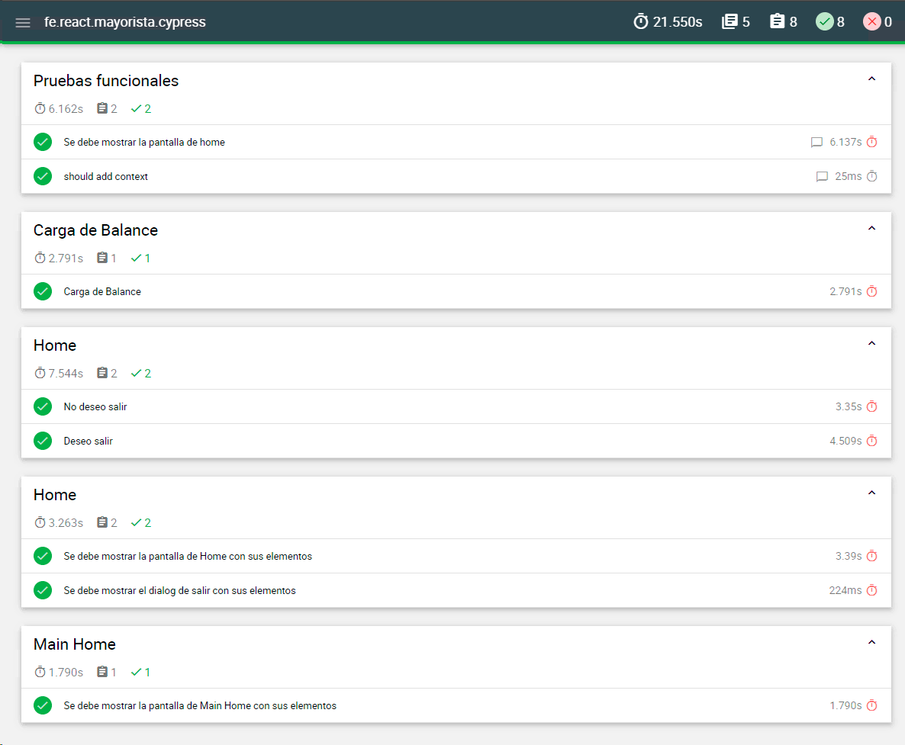

# [](https://www.bancogalicia.com.ar "Banco Galicia")

###### SPA - Calificación Crediticia
## End-to-End Testing con Cypress.io

[](https://www.cypress.io/ "Cypress.io website")
[](https://github.com/cypress-io/cypress "Cypress.io Github")
[](https://nodejs.org/es/ "Node.js website")
[](https://www.npmjs.com/ "Npm website")

La aplicación **Cypress.io** es la encargada de realizar las automatizaciones y testeos correspondientes de punta a punta de la aplicación desarrollada. Este proyecto contiene las configuraciones necesarias para realizar las pruebas.

## Table of Contents

- [Dependencies and libraries](#dependencies-and-libraries)
- [Setup workspace](#setup-workspace)
- [Scripts of run](#scripts-of-run)
  - [End-2-End testing](#end-2-end-testing)
  - [Generate reports](#generate-reports)
- [Custom configuration](#custom-configuration)
- [Custom environment variables](#custom-environment-variables)
- [Access Redux Store](#access-redux-store)
- [To Do/Features](#features)
- [Troubleshooting](#troubleshooting)
- [Contributing](#contributing)
- [Badges/Shields Generator](#badges-shields-generator)
- [Authors](#authors)

## Dependencies and libraries

- Node.js v10.5.3
- npm v6.4.1
- Cypress.io v3.4.1
- Mocha v6.2.0
- Chai
- Report Mochawesome v4.1.0
- Otros complementos

## Setup workspace

Instalar dependencias

`npm i`

## Scripts of run

### End-2-End testing

La aplicación debe estar iniciada en algún ambiente (localhost, desa, homo, int, qas, prod, etc) y se debe configurar el **baseUrl** en el archivo **cypress.json** que corresponde a su ambiente dentro de la carpeta **config**.

`npm run start` : Inicia la aplicación Cypress con una interfaz gráfica donde podrás realizar las pruebas visuales sobre los test en el ambiente de **producción**.

`npm run start:local` : Inicia la aplicación Cypress con una interfaz gráfica donde podrás realizar las pruebas visuales sobre los test en el **localhost**.

`npm run start:desa` : Inicia la aplicación Cypress con una interfaz gráfica donde podrás realizar las pruebas visuales sobre los test en el ambiente de **desa**.

`npm run start:int` : Inicia la aplicación Cypress con una interfaz gráfica donde podrás realizar las pruebas visuales sobre los test en el ambiente de **int**.

`npm run start:qas` : Inicia la aplicación Cypress con una interfaz gráfica donde podrás realizar las pruebas visuales sobre los test en el ambiente de **qas**.

Si se desea testear para un nuevo ambiente, basta con crear el archivo **cypress.json** dentro de la carpeta **config** con su configuración, agregar la tarea dentro de **scripts:{}** en el **package.json** con el nombre del nuevo ambiente y crear el archivo **.env** en variables. _(seguir la referencia de los que ya están creados)_

### Generate reports

`npm run cy:report`: Inicia la aplicación cypress en modo **serverless** y realiza los testeos del lado de la terminal **sin interfaz gráfica**.

`npm run report`: Inicia la aplicación cypress en modo **serverless** y realiza los testeos del lado de la terminal **sin interfaz gráfica** generando un archivo **HTML** dentro de la carpeta **mochawesome-report** donde contiene el resultado de todos los test.

#### Reporte Mochawesome



## Custom configuration

Se puede cambiar el valor de alguna configuración que viene por default en Cypress, solo basta con agregarlo en el archivo **cypress.json** correspondiente al ambiente a testar, estos archivos de configuración se encuentran dentro de la carpeta **config**.

##### Desactivar el watch de archivos

```
// config/cypress.<env>.json
{
    ...
    "watchForFileChanges":false,
    ...
}
```

## Custom environment variables

Para poder hacer testeos más robustos y escalables, Cypress te da la posibilidad de guardar tus propias variables dentro del nodo **env:{ }**.

Se debe crear las variables en los archivos **.env** que están en la carpeta **variables**, estas tiene que tener el prefijo **CYPRESS\_** y luego el nombre de la variable, para que luego quede disponibilizada en la configuración final.

##### Archivo .env

```
CYPRESS_FOO=MY FOO BAR
```

##### Cypress config

```
{
    ...
    env:{
        CYPRESS_FOO='MY FOO BAR'
    }
    ...
}
```

##### Consumir variable

```
Cypress.env()               // {CYPRESS_FOO: 'MY FOO BAR'}
Cypress.env('CYPRESS_FOO')  // 'MY FOO BAR'
```

## Access Redux Store

Para poder acceder al **Store** del **Redux** primero hay que exponerlo para cuando Cypress inicialice la SPA.

```
// src/app.js
...
import store from "./store";
...
class App extends Component {
 render() {
   
    // Exponer el store del redux para Cypress.io
   if (window.Cypress) {
     window.store = store;
   }
    
   return (
        <Provider store={store}>
        ...
        </Provider>
   );
 }
}

export default App;
...
```

Para poder consumir en los test el store expuesto.

```
...
    it("Consumir el store expuesto", () => {

        cy.window().its('store').invoke('getState').then(($store) => {
            console.log($store); // Return obj
        });
    })
...
```
Para más información, ingresá a esta entrada del blog de Cypress.io [Testing Redux Store](https://www.cypress.io/blog/2018/11/14/testing-redux-store/)

## To Do/Features

- [x] ~~Utilizar variables de entorno por medio de archivos .env para cada ambiente.~~
- [x] ~~Configuración de cypress por ambiente.~~
- [x] ~~Exponer y obtner los stores del Redux.~~
- [x] ~~Agregar contextos a los resultados del reporte HTML (text, image, video, obj, etc).~~
- [x] ~~Agregar screenshot al reporte cuando falla el test.~~
- [x] ~~Agregar video al reporte cuando falla el test.~~
- [ ] Actualizar Cypres.io a la v4.10.0

## Troubleshooting

- **Se carga Cypress, pero no se abre:** Con la actualización de node.js es probable de que la aplicación no esté actualizada a los cambios, por lo que posiblemente pueda pasar que se cargue el proyecto, pero no se abra la pantalla. Para poder ver el dash de Cypress, basta con apretar `Shift + Click Derecho` en el **icono** de Cypress en la **Barra de Tareas** y luego hacer click en **Maximizar**, esto pone la ventana en primer plano y podrás usarlo.

## Contributing

Los pedidos de requests son bienvenidos. Para cambios importantes, por favor abra primero un tema para discutir lo que le gustaría cambiar.

Por favor, asegúrese de actualizar las pruebas y la documentación según corresponda.

## Badges/Shields Generator

- Shield Generator [](https://shields.io/ "Shields.io website")
- Icons [](https://simpleicons.org/ "Simple Icons website")
- Image to Base64 [](https://www.base64-image.de/ "BASE64 Image website")

Parameters/properties:  
`?label=Npm`: Texto predeterminado del lado izquierdo, requiere URL-ENCODING para los espacios o caracteres especiales. Puede quedar vacío.

`?message=v6.4.1`: Texto predeterminado del lado derecho, requiere URL-ENCODING para los espacios o caracteres especiales. Puede quedar vacío.

`?logo=npm`: Nombre de un logotipo (npm, webpack, bitcoin, telegram, etc.) o use los nombres de los iconos de Simple Icons, si el nombre tiene espacio, reemplazarlos por guiones medios. También puede usar una imagen en BASE64, la altura tiene que ser >= 14px.

`?logoColor=FFFFFF`: Color del logotipo (se admiten los colores en hexadecimal, rgb, rgba, hsl, hsla y css).

`?labelColor=1A1A1A`: Color de fondo de la parte izquierda (se admiten los colores en hexadecimal, rgb, rgba, hsl, hsla y css). También se admite el nombre "colorA" heredado.

`?color=E66728`: Color de fondo de la parte derecha (se admiten los colores hexadecimal, rgb, rgba, hsl, hsla y css). También se admite el nombre "colorA" heredado.

`?style=flat-square`: Estilos del badge (plastic, flat, flat-square, for-the-badge, social).

Example custom shield:

```
https://img.shields.io/static/v1.svg?style=flat-square&label=<TEXT LABEL>&message=<TEXT MESSAGE>&labelColor=<HEX COLOR>&color=<HEX COLOR>&logo=<NAME OF SIMPLE ICON OR BASE64 CODE>
```

## Authors

[](https://baufest.com "Baufest")
[](mailto:mdelgado@baufest.com "Send email to Mex")